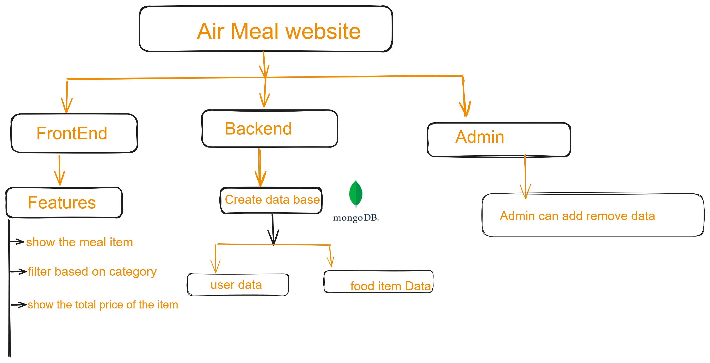
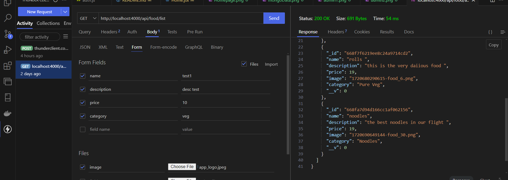
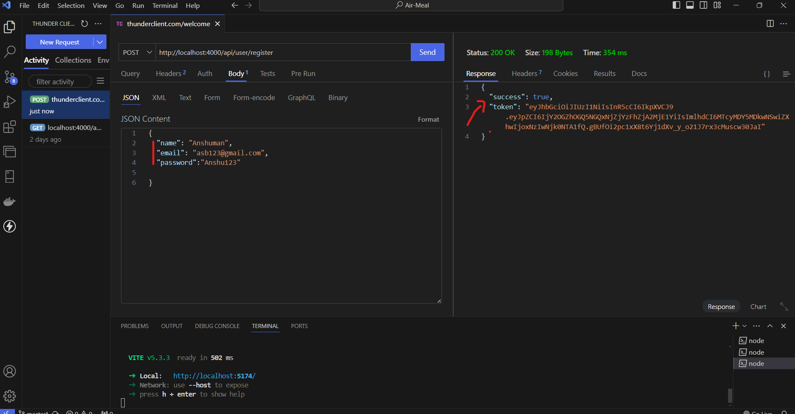
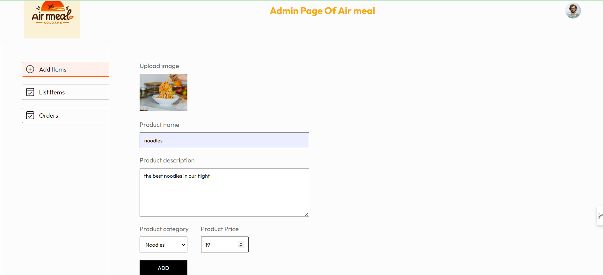
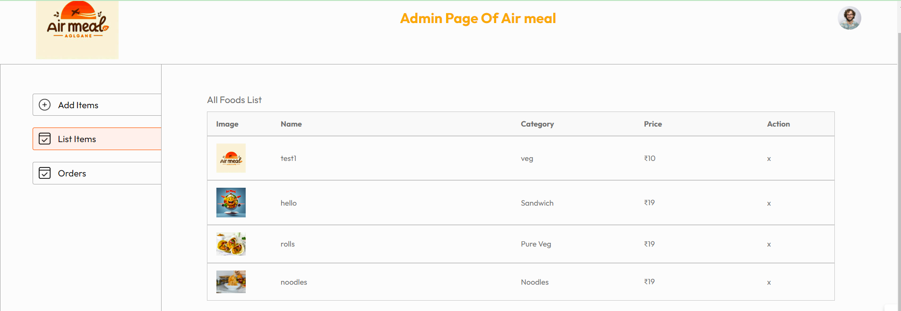
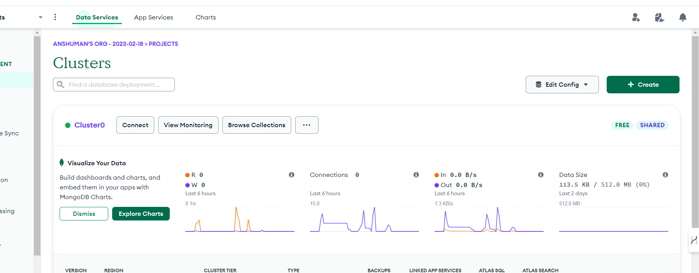
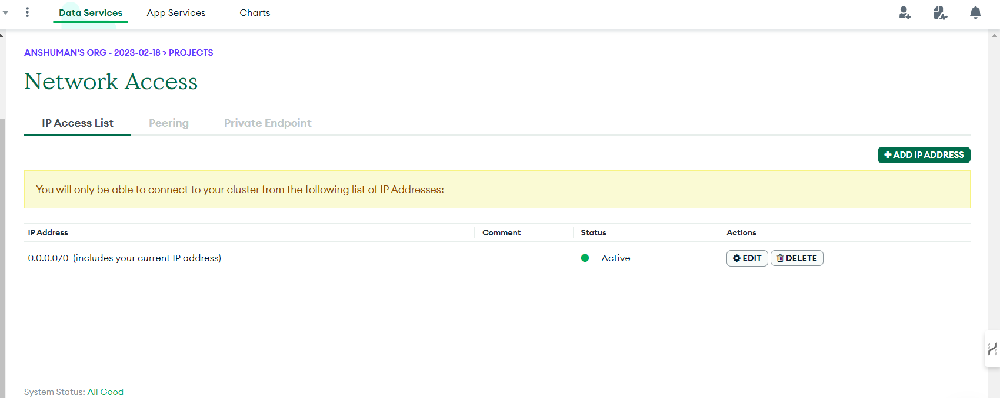
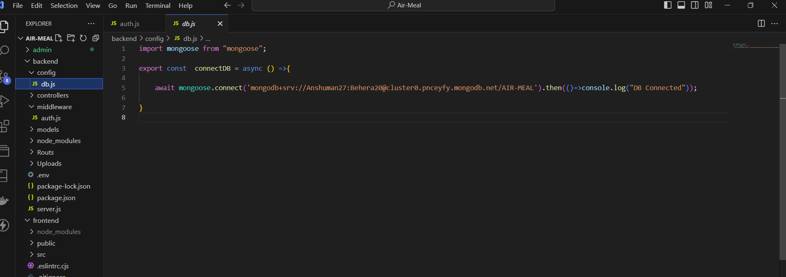

## Air Meal 

## What is AirMeal
### AirMeal is a React application designed to enhance the in-flight dining experience by allowing users to browse and order meals and drinks conveniently. The app features a variety of meals with detailed information and images, optional drink selection, and tag-based filtering for easy meal discovery. It also provides a clear total cost of the selected items

## Project Structure

## Frontend Features of AirMeal
### Meal List
- **Displays available meals** with basic information, including name, description, and price.
- **Shows images** for each meal to provide a visual representation.
- **Optional drink selection** for each meal.

### Tag-Based Filtering
- **Filter meals using tags** for dietary preferences or cuisine types.
- Meals are **dynamically filtered** based on the selected tag.

### Total Price Calculation
- **Shows the total cost** of selected meals and drinks.
- Provides **clear visibility** of the order's total price for effective budgeting.
---
## Backend Features of AirMeal

**The backend of AirMeal uses MongoDB to efficiently store and manage data.**
### Food Item Storage
- **Database:** All meal details, including name, description, price, image, and tags, are stored in a MongoDB database.
- **Advantages:** This setup allows for flexible and scalable data management.
  

### User Authentication
- **Data Storage:** User credentials and personal information are securely stored in MongoDB.
- **Authentication:** The backend supports user registration, login, and secure authentication using hashed passwords and token-based access.
   

---
## Admin Page Features for AirMeal

### Upload Food Items
- **Add Form:** Input details such as name, description, price, image, and tags.
- **Submit:** Adds new items to the database with validation.
 
### View and Manage Food Items
- **Item List**: Displays all food items with their details and images, including options to delete items.
- **Search/Filter**: Easily find, manage, and delete items from the database with a confirmation prompt.
   
## Show the Demotration Of the AirMeal by clicking the below Link
[youTube](https://www.youtube.com/watch?v=Uch8Vv_gReo)

[](https://www.youtube.com/watch?v=Uch8Vv_gReo)

## How to Setup & Run this Project

### To run the AirMeal project, follow these steps:

- Ensure you have **Node.js** and **npm** installed on your machine.
    - You can download Node.js [here](https://nodejs.org/).

###  First Run Backend then Frontend & Admin
- Open vs code  and open terminal 
-**Clone the Repository:**
```bash
https://github.com/anshumanbehera27/Air-Meal.git
```
- **move to backend folder**
```bash
 cd backend
 npm install
```
- **set up mongoDB**
- open this link for register and setup -[link](https://nodejs.org/).
  
-  Whitelist IP 0.0.0.0 & Click on Add Entry
-  
-  After that connect the mongodb and you go the link 
-  Copy past the url in backend -> config -> db.js
-  
- 4. **Run the Backend** 
```bash
 npm run server
```
---
### Steps To Run Frontend
1. open  new terminal 
```bash
cd frontend
npm install
```
2. **Run the FrontEnd** 
```bash
npm run dev 
```
--- 

## Step TO Run Admin 
1. Open new Terminal 
```bash
cd admin
npm install
```
2. **Run the Admin**
```bash
npm run dev 
```

